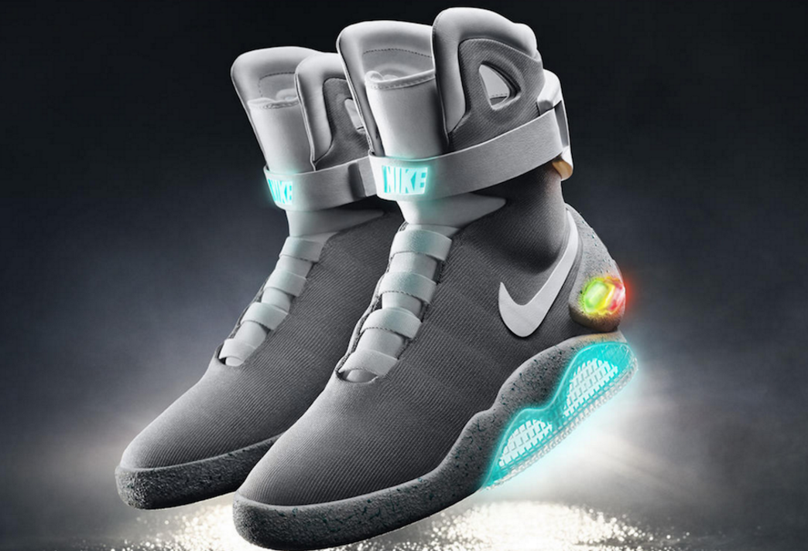

--- .slide x:-1000 y:-1500

<q>**Life After Edison**</q>

Ryan Conger

August 2016

--- .slide x:0 y:-1500

<q>**What we're going to talk about**</q>

* Coming off program
* Leaving GE (and coming back)
* <strike>Career</strike>Life learnings

--- .slide x:1000 y:-1500

<q>Who am I?</q>

<q>Ryan Conger</q>
* Technical Leader, Lifing Analytics
* Power Services
* EEDP class of 2009
* Not as good of a bowler as Ralph

--- #careertitle x:500 y:500 scale:3

<q>My Career (so far)</q>

--- #phase1 x:0 y:1000 scale:1

<b>2007-2009: GE Energy</b>

## Edison Program

* - Gas Turbine Repair
* - Gas Turbine Conceptual Design
* - Bently Nevada NPI
* - Bently Nevada M&D
* Off program: GT Conceptual Design

--- #phase2 x:0 y:1600 scale:1

<b>End of 2009: left GE</b>

 

<b>2009-2011: Synapse Product Development</b>

Mechanical Engineer and PM

--- #phase3 x:0 y:2200 scale:1

<b>2011: back to GE</b>

 

<b>2011-2015: GE Oil & Gas</b>

**Bently Nevada**
* Custom Products Engineer
* Lead Analytics Engineer
* Bently EEDP Manager

--- #phase4 x:0 y:2700 scale:1

<b>2015-today: GE Power</b>

**Power Services Engineering**
* Technical Leader, Lifing Analytics

--- #not x:-1500 y:1500 scale:3

But that's not 
the whole story.

--- #big x:4500 y:2100 rot:180 scale:4

so many things <b>didn't</b>  turn out how I expected

--- #tiny x:3925 y:2325 z:-3000 rot:300 scale:1

and that turned out to be a good thing.

--- #ing x:3500 y:-850 rot:270 scale:6
the <b class="positioning">obstacles</b>, <b class="rotating">failures</b> and <b class="scaling">changes</b> all contribute to the person I am today.

--- #phase1notes x:1000 y:5000 scale:1 rot:180

<b>2007-2009: Edison Program</b>

* Wanted to come off program in Nevada. No available jobs.
* Frustrated by slow product development cycle.
* Fall from innocence coming off program.

--- #phase2notes x:1000 y:4500 scale:1 rot:180

<b>2009-2011: Synapse</b>

* Thought a startup would fit me well. The intensity, travel and weather was too much for me.
* The autonomy was exhilarating. The responsibility was challenging.

--- #phase2anotes x:1000 y:4000 scale:1 rot:180

<b>2011: leaving Synapse</b>

* Interviewed for a 'dream job' (didn't get it). 
* Sought life/work balance.

--- #phase3notes x:1000 y:3500 scale:1 rot:180

<b>2011-2015: GE Oil & Gas, Bently Nevada</b>

* Swung far to the life side of that balance.
* Applied for team lead (didn't get it).
* Impatience led to wiki development.

--- #phase4notes x:1000 y:3000 scale:1 rot:180

<b>2015: Moved from Oil & Gas (NV) to Power (SC)</b>

* Moved back east to start a family and grow more in my career.
* Initially proposed a remote work agreement. 

--- #imagination x:6700 y:-300 scale:2

Have I learned anything useful through this?

--- #learnings x:6700 y:150 scale:1

* It doesn't matter what you've done
* Real relationships matter
* You choose your brand
* Things didn't work out? Good

--- #more x:6700 y:1500 scale:1 

<q>There is more to life than work</q>

--- #sum x:2500 y:1500 scale:1

<b>Summary</b>

* Your career won't go as planned
* It doesn't matter what you've done
* Real relationships matter
* You choose your brand
* There's more to life than work
* Things didn't work out? Good

--- #rstats x:-1000 y:5000

This deck was built using [Slidify](http://www.slidify.org) and styled with [impress.js](http://github.com/bartaz/impress.js). [View the source](https://github.com/raconger/eedp-engage/tree/gh-pages)</q>

